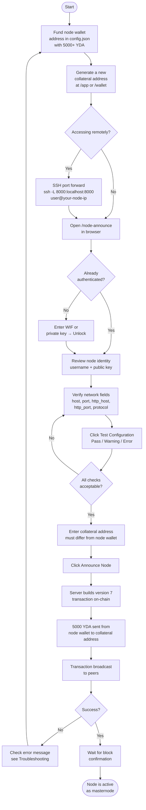

# Masternode Registration Tutorial

This guide walks you through registering your node as a dynamic masternode on the YadaCoin blockchain using the `/node-announce` endpoint.

---

## Overview

Dynamic masternode registration was introduced at block height **591000**. Any node operator can register their node by submitting a node announcement transaction on-chain. The registration requires a **5000 YDA collateral** that is sent from the node's wallet to a dedicated collateral address you control.

Once confirmed on-chain, your node will be recognized as an active masternode and eligible to participate in masternode-specific consensus and rewards.



---

## Prerequisites

Before you begin, make sure:

1. **Your node is fully synced** — the blockchain must be at or above block height 591000.
2. **Your node is running in NODE mode** — `config.json` must include `"node"` in the `modes` array.
3. **Your node has a configured identity** — `username`, `public_key`, and `username_signature` must be set in your peer config.
4. **Your node's wallet has at least 5000 YDA** — open `config.json` and find the `address` field. That is the wallet address that must be funded.

---

## Step 1 — Fund Your Node's Wallet

Find your node's wallet address in `config.json`:

```json
{
  "address": "1CpgKfJJ1ZX9spwJNkmQkg45CoWHaikXkb",
  ...
}
```

Send **at least 5000 YDA** to that address from an exchange or another wallet.

> **Important:** This is the node's operating wallet, **not** the collateral address. The 5000 YDA will be automatically moved from this wallet to the collateral address in the next step.

---

## Step 2 — Create a Dedicated Collateral Address

You need a **new, separate wallet address** to receive the 5000 YDA collateral. This address must be different from the node's wallet address in `config.json`.

Generate a new address using one of:

- **Software wallet:** Navigate to `http://localhost:8000/app` (or your node's HTTP address)
- **Hardware wallet:** Navigate to `http://localhost:8000/wallet`

Write down or securely save the private key for this new address — you will need it to spend the collateral funds in the future.

---

## Step 3 — Access the Node Announce Form

The `/node-announce` endpoint is **local-access only**. It can only be submitted from the machine running the node (`127.0.0.1` or `::1`).

**If you are on the node machine directly:**

```
http://localhost:8000/node-announce
```

**If you are accessing the node remotely via SSH, forward the port first:**

```bash
ssh -L 8000:localhost:8000 user@your-node-ip
```

Then open `http://localhost:8000/node-announce` in your local browser.

---

## Step 4 — Authenticate with Your Node Wallet

The form requires authentication before it can be submitted.

**If you are already logged in** via a wallet session, the form will display a green banner:

> ✅ **Already authenticated** via wallet session. You may leave the WIF field empty.

**If you are not logged in**, you must unlock with your node's private key:

1. Locate the `wif` (or `private_key`) field in your `config.json`:
   ```json
   {
     "wif": "L1SoJi1mgCLNCZE1zHAUvvjUwLLAAKj86M8jSV236T3v6HUF8svi",
     ...
   }
   ```
2. Paste the WIF or private key into the **"Node Private Key or WIF"** field.
3. Click **Unlock**.

A green "Authenticated" banner will appear once your wallet is unlocked.

---

## Step 5 — Review the Node Identity Section

The form will automatically display your node's identity pulled from the running config:

| Field          | Description                                        |
| -------------- | -------------------------------------------------- |
| **Username**   | Your node's registered username                    |
| **Public Key** | Your node's public key (first 32 characters shown) |

These values are read-only and derived from your node's configuration. If they are blank or incorrect, the node identity is not properly configured.

---

## Step 6 — Configure Network Settings

The form pre-fills network values from your `config.json` where possible.

| Field             | Description                                                          | Default                                        |
| ----------------- | -------------------------------------------------------------------- | ---------------------------------------------- |
| **Node Host**     | The public IP address or hostname other nodes use to connect via TCP | From `peer_host` in config                     |
| **Node Port**     | The TCP port your node listens on for peer-to-peer connections       | `8003`                                         |
| **HTTP Host**     | The public hostname used for HTTP API access                         | From `peer_host` or SSL common name            |
| **HTTP Port**     | The HTTP port for your node's API                                    | `8000` (or SSL port if HTTPS)                  |
| **HTTP Protocol** | `http` or `https`                                                    | `https` if SSL is configured, otherwise `http` |

**HTTPS / SSL notes:**

- HTTPS is only available if `cafile`, `certfile`, `keyfile`, and `port` are all configured under `ssl` in `config.json`.
- If SSL is not configured, the HTTPS option is disabled and HTTP is used automatically.

### Testing Your Configuration

Before submitting, click the **"Test Configuration"** button. This calls `/node-announce/test` and compares your entered values against what the node expects from its config. Each field shows:

- ✅ **Pass** — value matches config
- ⚠️ **Warning** — value differs from what config suggests (you can still proceed, but verify it is intentional)
- ❌ **Error** — a blocking issue such as selecting HTTPS when SSL is not configured

---

## Step 7 — Enter the Collateral Address

In the **Collateral** section, paste the dedicated collateral address you created in Step 2.

> **Rules:**
>
> - The collateral address is **required**.
> - It **must be different** from your node's wallet `address` in `config.json`.
> - IPv6 addresses are not supported for any network fields — use IPv4 or a hostname.

---

## Step 8 — Submit the Announcement

Review all fields, then click **"Announce Node"**.

What happens on submission:

1. The server builds a **version 7 transaction** containing your node announcement data in the transaction's `relationship` field.
2. The transaction sends **5000 YDA** from your node's wallet to the collateral address.
3. The transaction is signed with your node's private key, verified, and inserted into the mempool.
4. The transaction is broadcast to connected peers.

On success, you will see a green message:

> Node announcement broadcast successfully. Collateral of 5000 YDA sent to `<collateral_address>`

The response also includes the `transaction_signature` which you can use to track confirmation.

---

## Step 9 — Wait for Confirmation

The announcement transaction must be included in a block for your node to become active as a masternode. Monitor the transaction status using the explorer or the node API.

Once confirmed, the network will recognize your node as an active dynamic masternode.

---

## Troubleshooting

| Error                                                                 | Cause                                       | Fix                                                                     |
| --------------------------------------------------------------------- | ------------------------------------------- | ----------------------------------------------------------------------- |
| `This endpoint is only accessible from the local machine`             | POST submitted from a remote IP             | Use SSH port forwarding: `ssh -L 8000:localhost:8000 user@your-node-ip` |
| `Authentication required`                                             | No valid JWT token or wallet session        | Unlock your wallet using the WIF/private key from `config.json`         |
| `Node not configured`                                                 | Node is not running in NODE mode            | Add `"node"` to the `modes` array in `config.json` and restart          |
| `Node announcements are not active until block height 591000`         | Chain is not yet synced to the fork height  | Wait for your node to sync                                              |
| `Insufficient funds`                                                  | Node wallet has less than 5000 YDA          | Send YDA to the `address` in `config.json`                              |
| `collateral_address must be different from the node's wallet address` | Same address used for both                  | Generate a new address and use it as the collateral address             |
| `HTTPS requires SSL configured`                                       | SSL not set up but HTTPS was selected       | Configure SSL in `config.json` or switch to HTTP                        |
| `IPv6 addresses are not supported`                                    | An IPv6 address was entered in a host field | Use an IPv4 address or a hostname                                       |

---

## config.json Reference

Key fields used during masternode registration:

```json
{
  "address": "1CpgKfJJ1ZX9...", // Node's wallet address — must be funded with 5000+ YDA
  "wif": "L1SoJi1mgCLNC...", // Node's WIF — used to authenticate the form
  "private_key": "7e152c260b93...", // Node's private key (alternative to WIF)
  "peer_host": "203.0.113.10", // Public IP/hostname pre-filled into Node Host and HTTP Host
  "serve_port": 8000, // HTTP port pre-filled into HTTP Port
  "ssl": {
    "cafile": "/path/to/ca.pem", // Required for HTTPS
    "certfile": "/path/to/cert.pem",
    "keyfile": "/path/to/key.pem",
    "port": 443,
    "common_name": "mynode.example.com" // Pre-filled into HTTP Host when SSL is valid
  }
}
```

---

## Summary

| Step | Action                                                           |
| ---- | ---------------------------------------------------------------- |
| 1    | Fund your node's wallet (`address` in config) with 5000+ YDA     |
| 2    | Create a new, separate collateral address at `/app` or `/wallet` |
| 3    | Open `/node-announce` locally or via SSH port forward            |
| 4    | Authenticate using your WIF/private key from `config.json`       |
| 5    | Verify the pre-filled node identity                              |
| 6    | Review and test network configuration fields                     |
| 7    | Enter your collateral address                                    |
| 8    | Click "Announce Node" and verify success                         |
| 9    | Wait for the transaction to be confirmed on-chain                |
