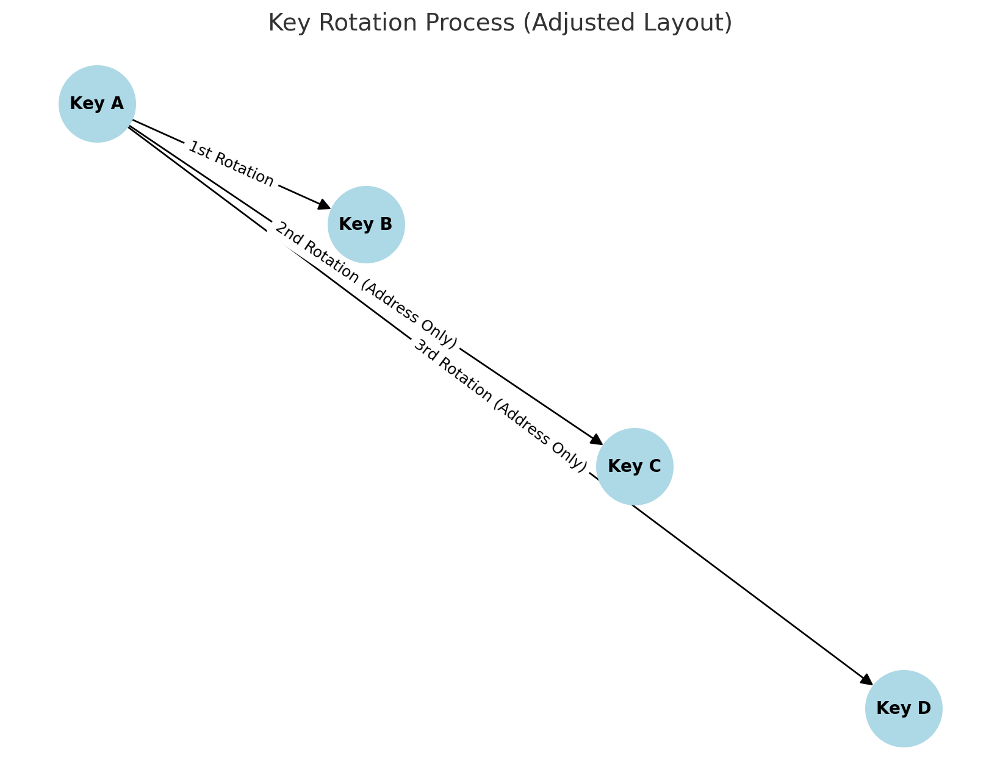
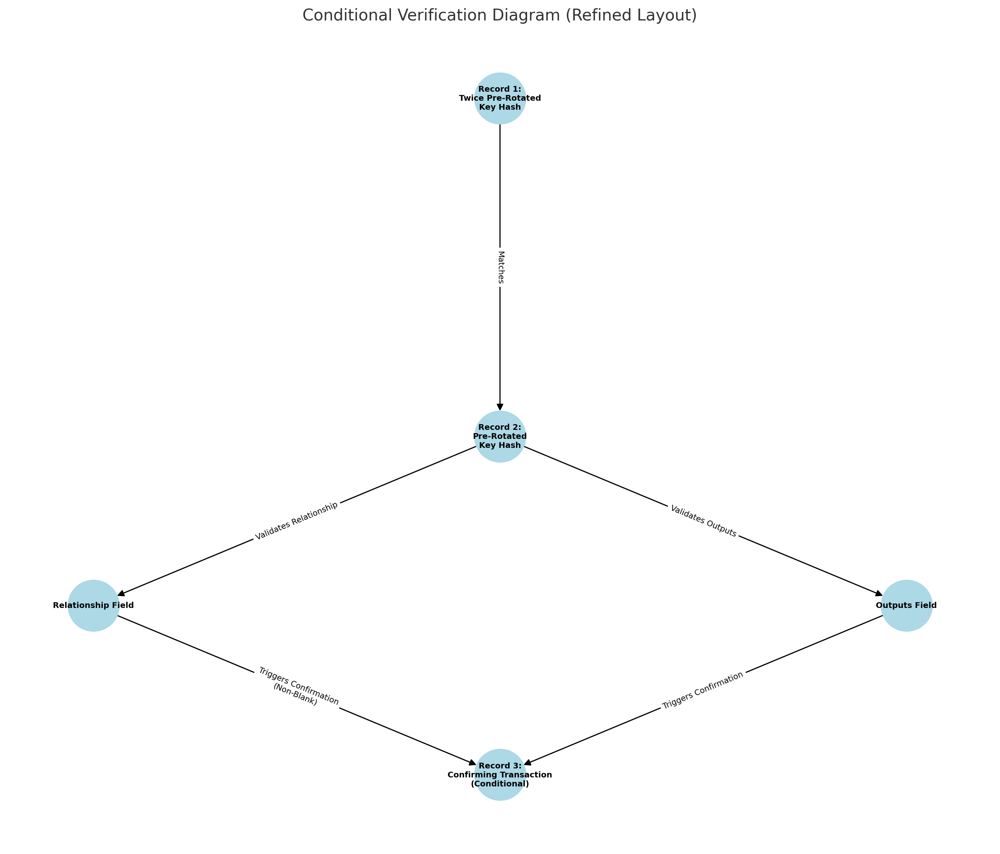
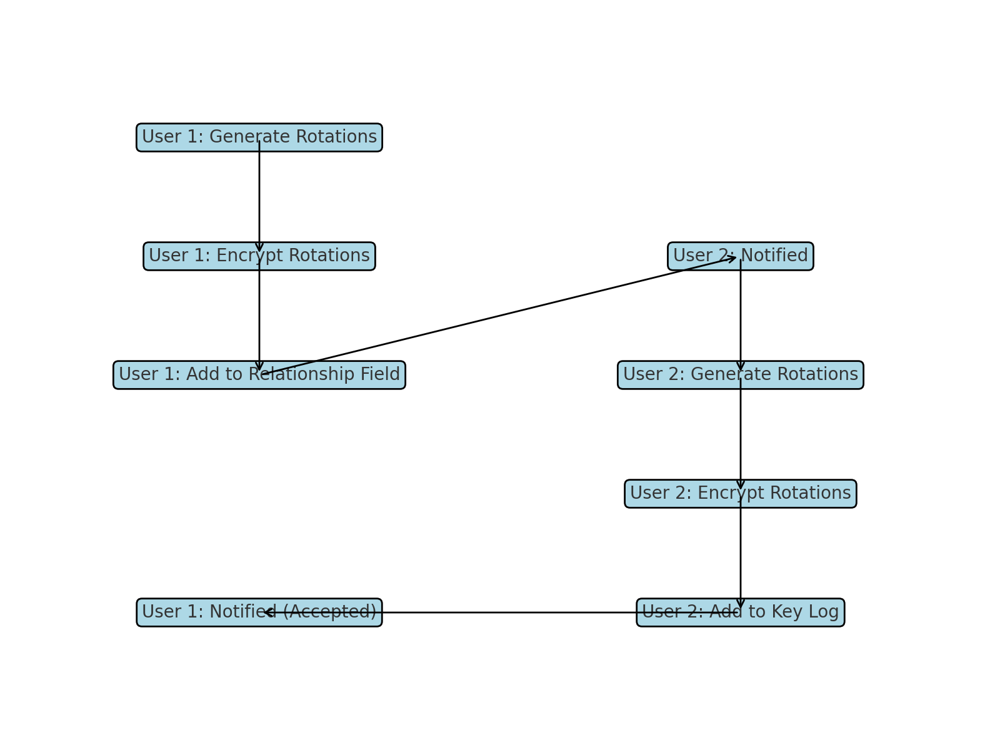
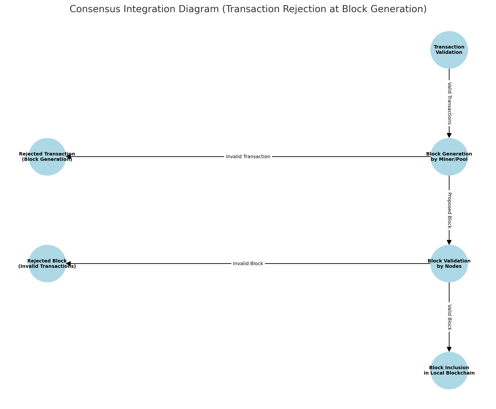

**Whitepaper**

**Title:** A Method for Protecting Blockchain Integrity Against Stolen Private Key Transactions

**Abstract**
This paper introduces a method to safeguard blockchain systems from fraudulent transactions caused by stolen private keys. It employs multi-rotation key derivation and cryptographic validation, logging key hashes on-chain to ensure only valid transactions are accepted. Unlike static methods, this approach integrates dynamic key management directly into blockchain consensus, providing strong defenses against brute-force attacks and unauthorized access. The solution is consensus-agnostic, compatible with Proof of Work (PoW) and other mechanisms, and supports critical applications such as financial operations and decentralized identity systems, ensuring security, integrity, and trust.

**Background**
Blockchain systems rely heavily on private keys to generate cryptographic signatures, which are used for transaction validation. However, private key compromise remains a significant vulnerability, enabling attackers to generate valid, impersonated signatures for unauthorized transactions. Current solutions, such as multi-signature (multi-sig) wallets and threshold cryptography, attempt to mitigate these risks by requiring multiple signatures or splitting private key control across parties. While effective in some cases, these methods introduce complexity and do not fully prevent fraudulent transactions from being included in a block. This invention addresses these gaps by introducing a secure key rotation and validation mechanism.

**Technical Solution**

**Key Derivation Algorithm and Brute Force Mitigation**

This invention utilizes a hierarchical deterministic (HD) wallet structure, based on the BIP32 standard, to derive keys while incorporating multi-rotation capabilities to enhance security. Each rotation derives a sequence of four child keys from the parent key using the Key Derivation Parameter (KDP) as the derivation index. The KDP, such as a PIN or password, acts as an additional cryptographic input, ensuring that every derived key is uniquely tied to the KDP. This enhances security by making brute force attacks computationally infeasible without the correct KDP.

1. **First Rotation:** Specifies the next key to use.
2. **Second Rotation:** Produces the address of the key two rotations ahead.
3. **Third Rotation:** Produces the address of the key three rotations ahead.

These rotations ensure that the addresses for rotations two and three are stored on-chain, while the corresponding keys are not retained, minimizing exposure to attacks.

Even if an attacker possesses the private key and chaincode, brute-forcing the derivation process remains computationally infeasible due to the vast search space and computational intensity of deriving each key. Assuming the attacker uses highly optimized hardware capable of performing 1 billion derivations per second, it would still take approximately \(8.63 \times 10^{42}\) years to brute force all possible key combinations across the four rotations. This multi-rotation structure exponentially increases brute force difficulty, providing a robust security advantage.

**Log Structure**

Each transaction includes a subset of fields that form the key log. These fields ensure the integrity of the key rotation process and are used during transaction validation. Specifically, they allow nodes to verify that each transaction aligns with the expected sequence of key rotations. The log contains the following fields:

1. `twice_prerotated_key_hash`: Ensures continuity by matching the `prerotated_key_hash` of the subsequent record. This provides a cryptographic linkage that nodes validate during consensus, ensuring unauthorized or inconsistent key rotations are rejected.
2. `prerotated_key_hash`: Matches the hashed public key of the next record, confirming that the correct key derivation process has been followed.
3. `public_key`: Serves as the primary identifier for deriving and verifying key hashes, linking the transaction to the cryptographic key used for signing.

By validating these fields in sequence, the system ensures that every transaction adheres to the established key rotation protocol. This prevents unauthorized transactions by creating a verifiable chain of cryptographic dependencies. Any deviation from this sequence would result in transaction rejection during consensus.

**Verification Rules**

- Record 1 must already be on-chain.
- If Record 1 is not present on-chain, Record 1 will initialize a new log. For log initialization, Record 2 is only required if one of the **additional record trigger conditions\*** listed below is met.
- The `twice_prerotated_key_hash` of Record 1 must match the `prerotated_key_hash` of Record 2.
- The `prerotated_key_hash` of Record 1 must match the hashed public key of Record 2.
- The `twice_prerotated_key_hash` of Record 1 must match the hashed public key of Record 3.
- The `twice_prerotated_key_hash` of Record 2 must match the `prerotated_key_hash` of Record 3.
- Each transaction public key is hashed, and the consensus layer of each node will perform a blockchain search for an existing key log entry with `twice_prerotated_key_hash` or `prerotated_key_hash` that matches the hashed public key. If the public key has a key log entry, these key log validation rules are applied.
- Record 3 is only required if one of the **additional record trigger conditions\*** listed below is met.

**\*Additional record trigger conditions**

1. One of the output addresses in the `outputs` field of the transaction, which is a list of UTXOs, does not match the `prerotated_key_hash` of the same transaction, indicating that the transaction sends to a key outside the key chain. In this case, a second transaction (Record 3) must be present during consensus validation or in the mempool during block generation validation. This confirming transaction must have a single UTXO entry in the `outputs` field with an address matching `prerotated_key_hash`, and its `relationship` field must be blank.
2. The `relationship` field of a transaction is not blank. In this case, a confirming transaction (Record 3) must also have a single UTXO entry in the `outputs` field with an address matching `prerotated_key_hash`, and its `relationship` field must be blank.

**Log Branching**

Log branching enables the creation of a new set of rotations that interoperate with another user's key log. This process ensures cryptographic continuity while establishing a secure connection between two independent logs. The branching process involves the following steps:

1. **Generating New Rotations:**

   - A new set of rotations is derived using an additional bit of data unique to the new branch along with the user's Key Derivation Parameter (KDP).

2. **Encryption of Rotations:**

   - The newly generated rotations are encrypted using the latest public key of the other user's log.

3. **Inclusion in Relationship Field:**

   - The encrypted rotations are included in the `relationship` field of the initiating user's key event.
   - The other user is notified that encrypted data is available for them because the `outputs` address of the key log matches the hash of the other user's latest public key.

4. **Confirmation Key Event:**

   - A second key event is created to confirm the branching. This confirmation event includes:
     - A blank `relationship` field.
     - A single UTXO entry in the `outputs` field that matches the `prerotated_key_hash`.

5. **Accepting the Log Branch (User 2):**
   - The second user generates a new set of key rotations using their KDP and a date specific to the requesting user.
   - This information is encrypted and placed on User 2's key log in a key event.
   - User 1 is notified that the branch has been accepted because the key log entry uses the hash of the other user's latest public key.

**Validation of Log Branching:**

- The branching process is validated through the consensus mechanism, ensuring that both the initiating key event and the confirming key event comply with the log's cryptographic rules.

**Security Benefits of Log Branching:**

- Establishes secure cryptographic relationships between independent logs.
- Protects sensitive rotation data using encryption.
- Maintains the integrity of both logs while enabling interoperation.

**Consensus Integration**

- Nodes independently validate blocks for inclusion in their local copies of the blockchain. Transactions are inserted into blocks during block generation by the miner or pool, with the consensus layer ensuring the block adheres to validation rules.
- The consensus layer evaluates the block as a whole, ensuring all transactions within adhere to the validation rules.
- Any block containing invalid transactions is rejected outright, maintaining blockchain integrity.

### **Transaction Validation Scenarios**

#### **Two-Record Scenario (No Third Record Required)**

| **Field**                   | **Record 1 (on-chain)** | **Record 2**      |
| --------------------------- | ----------------------- | ----------------- |
| `twice_prerotated_key_hash` | `hashed_pubkey_3`       | `hashed_pubkey_4` |
| `prerotated_key_hash`       | `hashed_pubkey_2`       | `hashed_pubkey_3` |
| `public_key` (hash)         | `hashed_pubkey_1`       | `hashed_pubkey_2` |

##### **Key Relationships**

1. **Record 1 (on-chain):**
   - `outputs.address` matches `prerotated_key_hash` (`hash_2`).
   - `twice_prerotated_key_hash` (`hash_3`) matches `prerotated_key_hash` in Record 2.
2. **Record 2:**
   - `outputs.address` matches `prerotated_key_hash` (`hash_3`).
   - No third record required as all validation rules are satisfied.

---

#### **Three-Record Scenario (Third Record Required)**

<table>
   <thead>
      <tr>
         <th><strong>Field</strong></th>
         <th><strong>Record 1 (on-chain)</strong></th>
         <td style="background-color: yellow"> <strong>Record 2</strong></td>
         <th><strong>Record 3</strong></th>
      </tr>
   </thead>
   <tbody>
      <tr>
         <td><code>twice_prerotated_key_hash</code></td>
         <td><code>hashed_pubkey_3</code></td>
         <td style="background-color: yellow"> <code>hashed_pubkey_4</code></td>
         <td><code>hashed_pubkey_5</code></td>
      </tr>
      <tr>
         <td><code>prerotated_key_hash</code></td>
         <td><code>hashed_pubkey_2</code></td>
         <td style="background-color: yellow"> <code>hashed_pubkey_3</code></td>
         <td><code>hashed_pubkey_4</code></td>
      </tr>
      <tr>
         <td><code>public_key</code></td>
         <td><code>pubkey_1</code></td>
         <td style="background-color: yellow"> <code>pubkey_2</code></td>
         <td><code>pubkey_3</code></td>
      </tr>
      <tr>
         <td><code>outputs</code> (address)</td>
         <td><code>hashed_pubkey_2</code></td>
         <td style="background-color: orange"> <code>hashed_pubkey_not_in_log</code></td>
         <td><code>hashed_pubkey_4</code></td>
      </tr>
      <tr>
         <td><code>relationship</code></td>
         <td>(Blank)</td>
         <td style="background-color: orange"> <code>metadata_encrypted</code></td>
         <td>(Blank)</td>
      </tr>
   </tbody>
</table>

##### **Key Relationships**

1. **Record 1 (on-chain):**
   - `outputs.address` matches `prerotated_key_hash` (`hashed_pubkey_2`).
   - `twice_prerotated_key_hash` (`hashed_pubkey_3`) matches `prerotated_key_hash` in Record 2.
2. **Record 2:** (highlighted above)
   - `outputs.address` does not match `prerotated_key_hash` (`hashed_pubkey_not_in_log`), triggering the need for a confirming transaction.
   - `relationship` is not blank (`metadata_encrypted`), triggering the need for a confirming transaction.
3. **Record 3:**
   - `outputs.address` matches the `prerotated_key_hash` in Record 2 (`hashed_pubkey_4`).
   - Ensures cryptographic continuity.

---

### **Summary of Scenarios**

- **Two-Record Scenario:** The sequence completes without additional conditions.
- **Three-Record Scenario:** A third record is required to satisfy validation rules when the `relationship` field in Record 2 is non-blank or an output address does not equal its own prerotated_key_hash field.

**Security Features**

1. **Key Rotation Integrity**

   - Ensured by consensus. Nodes validate transactions against the on-chain key log to verify proper key rotation. This prevents fraudulent or tampered key rotations from being accepted.

2. **Replay Attack Prevention**

   - Transactions cannot be reused or manipulated, as they are hashed (SHA-256), and the hash is signed using a key consistent with the key log entries.

3. **Brute Force Mitigation**

   - The Key Derivation Parameter (KDP), such as a PIN or password, is required for key rotation. This exponentially increases the difficulty of brute force attacks, as the attacker must correctly derive all four child keys in sequence to compromise a single rotation.
   - Key rotations leverage a hierarchical deterministic (HD) wallet structure, deriving four child keys per rotation. The large search space provided by this multi-rotation structure makes brute force attacks computationally infeasible.

4. **Compromised Node Mitigation**

   - Nodes broadcasting invalid key logs are identified and rejected during consensus, ensuring the integrity of the blockchain.

5. **Safeguards**
   - Transaction data is hashed using SHA-256, and these hashes are signed and secured within the blockchain using merkle roots and block headers, preventing retroactive tampering.
   - Key log data is redundantly stored across all nodes, ensuring availability and integrity.
   - No fallback mechanisms exist; transactions failing cryptographic checks are outright rejected.
   - Validation is performed both during transaction inclusion in blocks and at the consensus layer, ensuring robust protection against invalid transactions.

**Potential Applications**

- Financial and identity systems requiring high transaction integrity. This invention ensures that only valid transactions are authorized, reducing the risk of fraud in financial operations and enhancing the reliability of identity verification processes in decentralized systems.
- Decentralized applications (dApps) and identity verification systems with sensitive data. The enhanced security provided by this method ensures reliable identity validation processes and protects sensitive user data, consolidating these capabilities into a streamlined and robust framework.

**Edge Cases and Challenges**

1. **Network Forks**
   - Forks could create temporary inconsistencies, akin to other blockchain systems.
2. **Latency**
   - Ensuring timely validation under high transaction volumes may require optimized node performance.

**Conclusion**
This invention provides a robust mechanism for enhancing blockchain security against private key compromise. Compared to traditional methods that rely on static measures or external monitoring, this solution uniquely integrates dynamic key rotation and pre-rotated key validation, directly leveraging blockchain consensus to ensure enhanced protection and scalability. By combining these features, it prevents fraudulent transactions while enabling high scalability in environments with significant transaction volumes. This design ensures compatibility with existing infrastructure, making it particularly appealing for enterprise-level applications. These advantages position it as a significant improvement over current systems like KERI and traditional HD wallets, offering enhanced

**Glossary**

- **SHA-256:** A cryptographic hash function in the SHA-2 family that produces a 256-bit (32-byte) fixed-length output, regardless of the input size. It is widely used in blockchain systems to secure transaction data, create Merkle trees, and ensure data integrity by making it computationally infeasible to reverse or find collisions.

- **Address:** A hashed representation of a public key, often derived using a hash function like SHA-256 followed by RIPEMD-160 in Bitcoin. It is used to identify the sender or recipient in a blockchain transaction and adds a layer of privacy by obfuscating the original public key.

- **BIP32 HD Wallet:** A hierarchical deterministic wallet defined by Bitcoin Improvement Proposal 32. It allows for the generation of a tree of private and public keys from a single seed. The HD wallet structure supports multiple independent accounts and key management while requiring only the seed for backup and recovery.

- **Key Derivation Parameter (KDP):** A cryptographic input, such as a PIN or password, that adds a secondary layer of security to the key derivation process. It ensures that the keys derived are unique to the user and prevents brute force attacks by requiring both the private key and the correct KDP for successful key generation.

- **UTXO (Unspent Transaction Output):** A unit of cryptocurrency that remains unspent after a transaction. UTXOs are the building blocks of blockchain transactions, representing inputs available for spending in future transactions. Each UTXO is uniquely identified and tracked on the blockchain.

- **Public Key:** A cryptographic key derived from a private key using an asymmetric cryptographic algorithm like Elliptic Curve Digital Signature Algorithm (ECDSA). It is used to verify digital signatures and is shared openly, allowing others to validate signed transactions.

- **Private Key:** A cryptographic key used to sign transactions, proving ownership of blockchain assets. It must be kept secret, as anyone with access to the private key can generate valid signatures and potentially misuse the associated assets.

- **Merkle Root:** The single hash at the top of a Merkle Tree that represents all transaction hashes in a block. By hashing pairs of transaction hashes recursively, the Merkle root provides a compact and tamper-proof summary of all transactions in a block.

- **Consensus Layer:** A part of the blockchain system that ensures agreement among nodes on the validity of transactions and blocks. It prevents double-spending and maintains a consistent ledger across the network.

- **Key Log:** A record stored on-chain that tracks the progression of key rotations, including pre-rotated and twice-pre-rotated key hashes. The key log is used to validate transactions and ensure the integrity of the key rotation sequence.

- **Key Rotation:** The process of generating new cryptographic keys from existing ones in a predefined sequence. This mechanism ensures that the keys in use remain secure over time, even if older keys are compromised.

- **Pre-Rotated Key Hash:** A hashed representation of a cryptographic key that is next in line to be used in a transaction. It is stored on-chain to validate future key derivations and ensure the integrity of the key rotation sequence.

- **Twice Pre-Rotated Key Hash:** A hashed representation of a cryptographic key two rotations ahead in the key sequence. It ensures continuity and allows for verification of key rotations before they occur.

- **Proof of Work (PoW):** A consensus mechanism used by many blockchain systems where participants solve complex mathematical problems to validate transactions and create new blocks. PoW is designed to be resource-intensive, deterring malicious actors from tampering with the blockchain.

YadaCoin Open Source License (YOSL) v1.1

Copyright (c) 2017-2025 Matthew Vogel, Reynold Vogel, Inc.

This software is licensed under YOSL v1.1 – for personal and research use only.
NO commercial use, NO blockchain forks, and NO branding use without permission.

For commercial license inquiries, contact: info@yadacoin.io

Full license terms: see LICENSE.txt in the YadaCoin repository.
